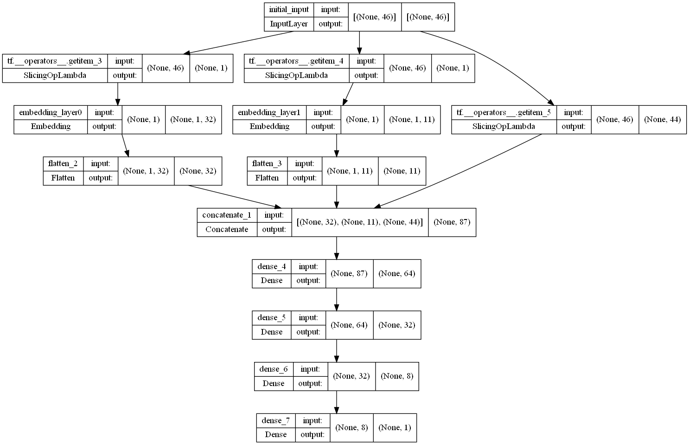
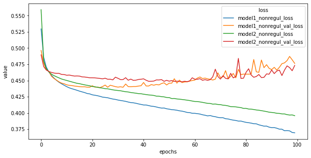
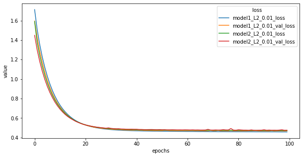

# HR Analytics
A binary classifier to predict whether data scientists will look for new jobs or not. 
Dataset source: [Kaggle_HR_Analystics: Job Change of Data Scientists](https://www.kaggle.com/datasets/arashnic/hr-analytics-job-change-of-data-scientists) 
Prediction Dataset's answer source: [job change dataset answer](https://www.kaggle.com/datasets/arashnic/job-change-dataset-answer)

| Class | Description |
| ----- | ----------------------|
| 0     | Not looking for a job change |
| 1     | Looking for a job change     |

## **Data**
The dataset is imbalanced as the minority class, class 1, is only represented by 24.93% of the total data points. I have tried two solutions to deal with the problem of imbalanced data:
1. To set class weights during model training. According to TensorFlow's tutorial, setting class weights during training can allow the model to pay more attention to the minority class.[1](TensorFlow’s tutorials: Classification on imbalanced data, 2022, class weights)

2. The other approach is to use synthetic minority over-sampling (SMOTE) to increase the data points of the minority class in the training dataset. According to Imbalance-Learn user guide about over-sampling, new minority class data points are generated between original minority class data points and their k-nearest neighbors. [2] (Imbalance-Learn: Over-sampling) To implement this approach, I use the Imbalanced-Learn package.

## **Models**
Two deep neural network models (model1 and model2) are created for prediction. Both models are constructed using Tensorflow. The only difference between the two models is that model1 has an extra step to embed categorical columns of the input dataset, as shown below:
Please see the picture as below: 

*Diagram of model 1*  
The intention of building two models is to see whether adding embedding layers in the model will cause overfitting. Without regularization, model1 (embedding layers) has larger variance than model2. With regularization, both models perform very similarly.

Without regularization: 

With regularization: 

## **Tuning models**
After building model1 and model2, I trained instances of both models with each of the two solutions for imbalanced data, and did hyperparameter tuning on each model using TensorBoard plugin tools. The optimal hyperparameters will depend on the tradeoff between false positive and false negative. Tuning results are shown in the table below:

| Metrics          | Model and Hyperparameters               | Results (examples)    |
| ---------------- | --------------------------------------- | --------------------- |
| Highest Accuracy | Model1                                  | True Negatives:  1347 |
|                  | SMOTE over-resampling                   | False Positives:  206 |
|                  | L2 regularization with lambda rate 0.01 | False Negatives:  324 |
|                  | SGD optimization                        | True Positives:  252  |
|                  |                                         | Total Positives:  576 |
| Highest Precision| Model1                                  | True Negatives:  1347 |
|                  | SMOTE over-resampling                   | False Positives:  206 |
|                  | L2 regularization with lambda rate 0.01 | False Negatives:  324 |
|                  | SGD optimization                        | True Positives:  252  |
|                  |                                         | Total Positives:  576 |
| Highest Recall   | Model2                                  | True Negatives:  0    |
|                  | SMOTE over-resampling                   | False Positives:  1553|
|                  | L1 regularization with lambda rate 0.05 | False Negatives:  0   |
|                  | SGD optimization                        | True Positives:  576  |
|                  |                                         | Total Positives:  576 |
| Highest AUC      | Model1                                  | True Negatives:  1280 |
|                  | Setting class weights                   | False Positives:  273 |
|                  | L2 regularization with lambda rate 0.05 | False Negatives:  257 |
|                  | SGD optimization                        | True Positives:  319  |
|                  |                                         | Total Positives:  576 |
| Highest          | Model1                                  | True Negatives:  1280 |
| Precision-Recall | Setting class weights                   | False Positives:  273 |
| Curve(PRC)       | L2 regularization with lambda rate 0.05 | False Negatives:  257 |
|                  | SGD optimization                        | True Positives:  319  |
|                  |                                         | Total Positives:  576 |

## **Files**
**dnn_model1.py** 
model1 class

**dnn_model2.py** 
model2 class

**tuning.py** 
Hyperparameters tuning class

**preprocess.ipynb** 
Preprocessing the dataset and split the dataset into train/test sets.

**result_check.ipynb** 
Visualizing hyperparameters tuning and comparing results.

## References
[1] Classification on imbalanced data, TensorFlow’s tutorials. Retrived from https://www.tensorflow.org/tutorials/structured_data/imbalanced_data

[2] Over-sampling, Imbalance-Learn User Guide. Retrived from https://imbalanced-learn.org/stable/over_sampling.html
